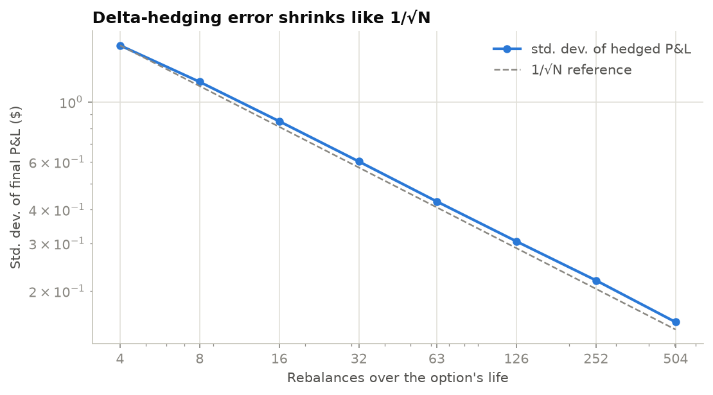
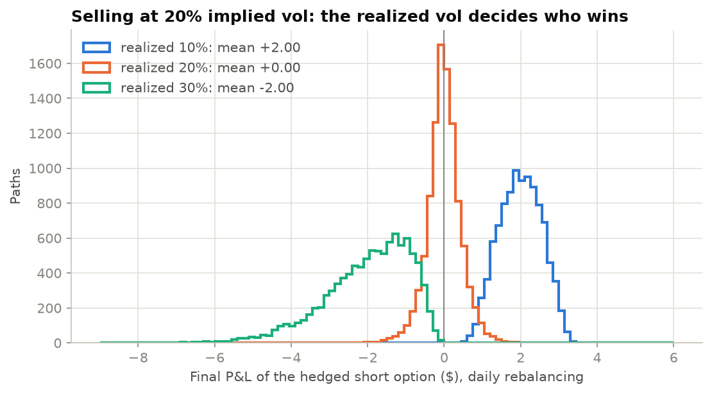

# Options Trainer

[](https://github.com/codyrchen/black-scholes-platform/actions/workflows/ci.yml)

Free practice for options questions in quant interviews: timed drills, an interactive Greeks lab and a
delta-hedging game. Underneath is a tested pricing library (Black-Scholes-Merton, implied vol, binomial trees,
Monte Carlo, hedging simulation). Every drill answer is computed by that library and checked by its tests.

**Live site:** _add your deployed URL here_

| Mode | What you practice |
| --- | --- |
| **Drills** | Timed rounds: ATM ≈ 0.4·σ·√T·S, straddle pricing, the rule of 16, forwards, put-call parity, Greek signs and scaling, delta-hedge sizing, BS price/delta/IV, and parity, vertical and butterfly arbitrage. Shareable challenge links replay the same questions. |
| **Greeks Lab** | Sliders for spot, strike, time, vol, rates and dividends, with live charts of every Greek against spot and time. A predict-then-reveal mode trains intuition. |
| **Hedging Game** | Sell an option and delta hedge it yourself; compare against the Black-Scholes hedger and no hedge, then run 14,000 simulations to see why the error scales like 1/√N. |
| **Learn** | Research notes whose charts and numbers come from the scripts in `research/`. |
| **Calculator** | Price, Greeks, implied vol, and today-vs-expiry P&L. |

## Results

From `research/` (rerun the scripts to regenerate the charts and the numbers on the site):

| Study | Finding |
| --- | --- |
| Delta-hedging error vs rebalancing | Log-log slope **−0.49** (theory −½). Daily rebalancing still leaves a std. dev. of ~10% of the premium. |
| Realized ≠ implied vol | Selling at 20% IV: realized 10% earns **+$2.00**, realized 30% loses **−$2.00**. The vega × (σ<sub>i</sub> − σ<sub>r</sub>) prediction is ±$1.98. |
| Binomial (CRR) convergence | Error slope **−1.07** (theory −1), with strike-placement oscillations of over 10×. |
| Monte Carlo convergence | Error slope **−0.49** (theory −½). Antithetic + control variates cut variance **21×**. |
| American put | Early-exercise premium of $0.84 on a 1y, K=105, r=5% put. |

<p>
  
  
</p>

## How answers are verified

`pytest` runs 107 tests, many of them property-based with Hypothesis (plus 8 Jest tests for the browser pricer):

- **Black-Scholes:** Hull reference values; put-call parity and no-arbitrage bounds over random inputs; every
  analytic Greek matches a finite difference; expiry and zero-vol limits; vectorized = scalar.
- **Implied vol:** round-trip over σ ∈ [0.01, 3] and moneyness 0.6–1.6; Newton converges in ≤ 5 steps ATM; prices
  outside the no-arbitrage bounds are rejected.
- **Numerical methods:** CRR and Monte Carlo converge to Black-Scholes; American put ≥ European; American call =
  European with no dividends; variance reduction actually reduces variance.
- **Hedging:** error ∝ 1/√N; unbiased when vols match; the gamma/theta P&L attribution sums to the total.
- **Drills:** every generated question accepts its own answer, and the mental-math shortcut quoted in each
  explanation is within the grading tolerance; all arbitrage answer types occur; ids round-trip deterministically.
- **Vol smile:** the forward and discount factor are recovered from a synthetic chain with a known smile.
- **Frontend:** the browser's JS pricer matches golden values from the Python library.

## Methods

- **Pricing:** Black-Scholes-Merton with continuous dividend yield, vectorized with NumPy. The normal CDF uses
  `scipy.special.ndtr`, which stays accurate in the tails.
- **Implied vol:** Newton–Raphson on vega from a Brenner–Subrahmanyam initial guess, falling back to Brent's
  method when vega is tiny (deep ITM/OTM).
- **Binomial:** Cox-Ross-Rubinstein, European and American, vectorized backward induction.
- **Monte Carlo:** exact GBM terminal sampling, antithetic variates, and the discounted stock as a control variate
  with the regression-optimal coefficient.
- **Hedging:** discrete delta hedging of a short option with financing, dividends and proportional transaction
  costs. P&L is split into theta (½Γ·S²·σ²·dt), gamma (−½Γ·ΔS²) and a residual.
- **Vol smile:** the forward and discount factor are backed out of put-call parity by regression; implied vols
  come from OTM options only.

Assumptions are the textbook ones: European exercise unless stated, GBM dynamics, constant r, q and σ.
`/learn/why-bs-is-wrong` on the site covers where these break.

## Run it locally

Requires Python 3.10+ and Node 18+.

```bash
python3 -m venv .venv && source .venv/bin/activate
pip install -r requirements-dev.txt
python3 app.py                      # API on http://localhost:5001

cd frontend && npm install && npm start   # site on http://localhost:3000
```

Checks (the same ones CI runs):

```bash
ruff check . && pytest
cd frontend && npm test -- --watchAll=false && npm run build
```

Research scripts:

```bash
python research/convergence.py
python research/hedging.py
python scripts/fetch_chain.py SPY && python research/vol_smile.py   # needs network access to Yahoo Finance
```

The smile study is published on the site only after you run it: the fetch script snapshots a real chain into
`data/`, and the Learn page picks it up from `results.json`.

## Deploy

1. **API → Render.** New → Blueprint → this repo (uses `render.yaml`). Set `CORS_ORIGINS` to your frontend URL.
2. **Frontend → Vercel.** Import the repo with root directory `frontend`, and set `REACT_APP_API_URL` to the
   Render URL. `vercel.json` handles client-side routes.
3. **Optional analytics:** set `REACT_APP_PLAUSIBLE_DOMAIN` for cookie-free visitor counts.

Render's free tier sleeps when idle, so the first request after a while takes a few seconds.

## API

Versioned routes live under `/api/v1` (configurable with `API_PREFIX`). Interactive OpenAPI docs are at `/api/v1/docs`.

| Route | Purpose |
| --- | --- |
| `GET /api/health` | Liveness |
| `POST /price` | `spot, strike, maturity, rate, volatility, dividend_yield?, option_type` → price and Greeks (theta per day; vega, rho per 1%) |
| `POST /implied-vol` | `market_price` + the above minus volatility → `implied_vol, method, iterations`; 422 `NO_IMPLIED_VOL` outside bounds |
| `POST /payoff` | Expiry P&L curve; with `maturity` and `volatility` also today's value |
| `GET /drills?category=&difficulty=&count=&seed=` | A round of questions (no answers) |
| `GET /drills/categories` | Topics and difficulties |
| `POST /drills/check` | `id, response` → `correct, answer, explanation` |
| `POST /hedging/simulate` | One path with the BS hedger, no-hedge P&L and the P&L breakdown |
| `POST /hedging/study` | Hedged P&L statistics across rebalancing frequencies |

Drill questions are stateless: an id such as `put_call_parity-123456` is a generator name and a seed, so the
server regenerates the question to grade it and needs no database.

Errors use one envelope, `{"error": {"code", "message", "details", "request_id"}}`, and every error response
carries an `X-Request-Id` header.

| Variable | Default | Purpose |
| --- | --- | --- |
| `PORT` | `5001` | API port (5000 is taken by AirPlay on macOS) |
| `HOST` | `0.0.0.0` | Bind address |
| `API_PREFIX` | `/api/v1` | Versioned route prefix |
| `CORS_ORIGINS` | `*` | Comma-separated allowed origins; set it in production |
| `LOG_LEVEL` | `INFO` | JSON log level |

## Layout

```
quant/            Pricing library (no web dependencies)
  black_scholes.py  implied_vol.py  binomial.py  monte_carlo.py
  hedging.py        drills.py       smile.py
backend/          Flask API: routes, schemas, errors, logging
tests/            pytest + hypothesis suite
research/         Studies that generate the Learn pages' charts and numbers
scripts/          healthcheck.py, fetch_chain.py
frontend/         React app (pages/, lib/bs.js browser pricer, public/research/ generated charts)
```
